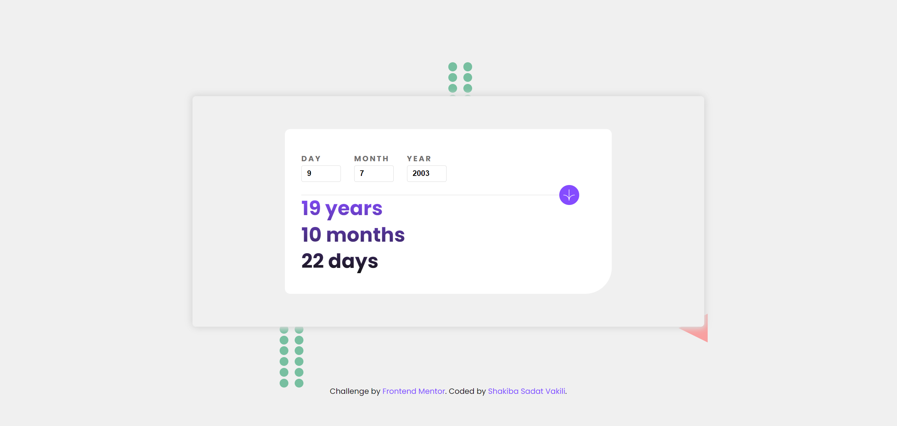

# Age Calculator App

This is a solution to the [Age calculator app challenge on Frontend Mentor](https://www.frontendmentor.io/challenges/age-calculator-app-dF9DFFpj-Q). Frontend Mentor challenges help you improve your coding skills by building realistic projects.

## Welcome! 👋

### Built with

- Semantic HTML5 markup
- CSS custom properties
- Flexbox
- CSS Grid
- JavaScript

## links

- linkedin - [Shakiba Sadat Vakili](https://www.linkedin.com/in/shakiba-vakili/)
- GitHub - [@shakiba-vakili](https://github.com/shakiba-vakili)
- Frontend Mentor - [@shakiba-vakili](https://www.frontendmentor.io/profile/shakiba-vakili)
